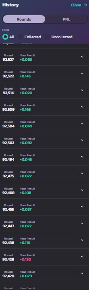

UPDATE1: 8 BNB/USDT Sold /// 3 CAKE/USDT Sold

#### I've been running a bot for PancakeSwap Prediction BNB/USD game for the past few months. 
Tons of dollars have been made. Now I've found another binary trading platform with static payouts (can go a lot higher than some BNB on bet placement without getting lower payouts) and where I can enter whenever my signals agree to without having to wait for rounds to start/end.

That's why I'm selling my PancakeSwap bot to the first 10 buyers.
I won't sell to more than 10 since the payouts would take a hit and if you're buying me anything you're getting paid.

#### This bot, unlike all the others on Git showing you the same screenshot of rounds from last year, has been running until today. 
#### As you can see the screenshots show rounds 90k. 

The bot takes advantage of:
  - price delay from oracle
  - volume of the asset
  - 18 indicators, 4 free, 14 developed by me
  - pool size
  
To decide when to bet and which direction to take.
It places bets on the last block before the round closes making it almost impossible for copiers to get in.

I've done an auction recently where I've sold my strategy for 13k. Alhought the buyer will be use the strategy in Binance's Futures I will set the minimum price of this bot at 5BNB. After the 10 sells this repository will be deleted.

I'll talk a little bit more about it as I print some screenshots.

The screenshots above show some of the recent rounds. On the far right we can see the result and what each round won. When red the round was lost. When green we can see the bet size and the profit.

This website just shows the rounds results in a way much easier to read than the one from Pancake. But below are Pancake rounds, as you can see all above 90k.

These 2 screenshots are only here so you can check the actual results on the PancakeSwap Prediction Interface. This last version delivers a 72% winrate placing around 80 bets per day. 

Finally these 2 screenshots show my last 2 wallets that ran the bot.
Each wallet runs from 2 weeks to 1 month before I change it since there are a lot of copiers playing this game and they trace my wallets, tart copying and the payouts go down even though I place the bets on the last block before the rounds close.

############################################################################

The bot as I meantioned if for sale at 5 BNB.
The price is negotiable unless I get some quick sells after making the repository public since I won't sell to over 10 people.
I've also developed a bot for the game CAKE/USD but the pool size is still small to get huge gains, this one is only sitting at 2 BNB.

##### If you're interested just contact me at js.pdo.silv@gmail.com

I won't answer any questions regarding my strategy unless you're a buyer.

I won't do charity since this took a lot of my hardwork to develop.

I won't ask for your private keys as every other scammer to steal from you since their Pancake Prediction Bot is losing money.
We're here to profit so take it seriously.
